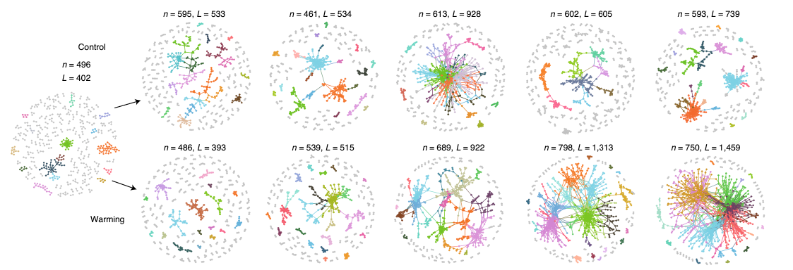

周集中老师团队2021年初，在Nature Climate Change杂志上发表了一篇气候变暖对微生物网络复杂性与稳定性影响的文章

绘图教程原发于宏基因组公众号：- [周集中团队Nature子刊中网络图布局的R语言可视化复现](https://mp.weixin.qq.com/s/H-VJYbdvCmN51Zw4p78ljw)


图一的a子图通过多个连续年际采样的网络图展示了气候变化对微生物网络的大致影响




网络图的风格有一种简介之美，同时网络之间差异的展示也非常醒目，十分拿人


该文章后续分析的大部分代码都在GitHub进行了公开分享，但其中没有包含上述网络图


这篇推送根据上图风格对网络图进行了复刻，内容包括(但不限于):  
- 节点按照模块划分上色  
- 边按照模块划分上色  
- 多个网络图的批量输出  


## 导入数据以及R包

```{r}
library(igraph)
library(dplyr)
library(Hmisc)
## 读入OTU/ASV表格，列为样本，行为物种
otu_rare <- read.delim('otutab.txt',header = T,row.names = 1,stringsAsFactors = F)
```

## 计算每组的子网络

按样本名筛选为3个组

```{r}
## 定义一些颜色
col_g <- "#C1C1C1"
cols <- c("#DEB99B" ,"#5ECC6D", "#5DAFD9", "#7ED1E4", "#EA9527", "#F16E1D" ,"#6E4821", "#A4B423",
          "#C094DF" ,"#DC95D8" ,"#326530", "#50C0C9", "#67C021" ,"#DC69AF", "#8C384F", "#30455C", "#F96C72","#5ED2BF")

trt_id <- c('KO','OE','WT') ## 定义样本的关键词，然后从样本名抓取处理的样本
split_otu <- lapply(apply(sapply(trt_id,function(x){grep(x,colnames(otu_rare))}),2,FUN = function(x){otu_rare[,x]}),function(x){x[-(which(rowSums(x)==0)),]})

## 有此处主要聚焦展示绘图方法，构建网络时没有对输入数据进行筛选
## 此外，笔者建议在样本量较小的情况下，推荐采用MENA的方法构建网络
g <- lapply(split_otu,function(x){
    occor<-WGCNA::corAndPvalue(t(x)/colSums(x),method = 'pearson')
    # occor<-WGCNA::corAndPvalue(t(x),method = 'pearson')
    mtadj<-multtest::mt.rawp2adjp(unlist(occor$p),proc='BH')
    adpcor<-mtadj$adjp[order(mtadj$index),2]
    occor.p<-matrix(adpcor,dim(t(x)/colSums(x))[2])
    ## R value
    occor.r<-occor$cor
    diag(occor.r) <- 0
    occor.r[occor.p>0.05|abs(occor.r)<0.4] = 0
    occor.r[is.na(occor.r)]=0
    g <-  graph.adjacency(occor.r, weighted = TRUE, mode = 'undirected')
    # 删除自相关
    g <- simplify(g)
    # 删除孤立节点
    g <- delete.vertices(g, which(degree(g)==0) )
    return(g)
})
 #你也可以用MENA的方法构建保存成如下形式接着跑代码，R中计算基于RMT的cutoff值太慢了（不推荐）
 save(g,file = 'network.rda')
#load('network.rda')
```

## 单图示例

列表`g`中包含三个`igraph`构建的无向网络，我们选取第一个来做下面的演示

### 计算网络模块

```{r}
## 提取第一个网络演示
g1 <- g[[1]]
# plot(g[[1]])

## 设置网络的weight，为计算模块性做准备
E(g1)$correlation <- E(g1)$weight
E(g1)$weight <- abs(E(g1)$weight)

## 计算网络模块
set.seed(007)
V(g1)$modularity <- membership(cluster_fast_greedy(g1))
```

### 添加节点以及边的颜色

按照模块设置节点的颜色 

选取包含节点数量前18个模块赋予不同的颜色，剩余模块赋予灰色
```{r}
V(g1)$label <- V(g1)$name
V(g1)$label <- NA
modu_sort <- V(g1)$modularity %>% table() %>% sort(decreasing = T)
top_num <- 18
modu_name <- names(modu_sort[1:18])
modu_cols <- cols[1:length(modu_name)]
names(modu_cols) <- modu_name
V(g1)$color <- V(g1)$modularity
V(g1)$color[!(V(g1)$color %in% modu_name)] <- col_g
V(g1)$color[(V(g1)$color %in% modu_name)] <- modu_cols[match(V(g1)$color[(V(g1)$color %in% modu_name)],modu_name)]
V(g1)$frame.color <- V(g1)$color
```

### 设置边的颜色

边的颜色与模块颜色保持一致 

由于边连接了两个节点，如果两个节点同属于一个模块，我们赋予其模块的颜色 

如果两个两个节点属于不同模块，我们赋予其灰色

```{r}
E(g1)$color <- col_g
for ( i in modu_name){
  col_edge <- cols[which(modu_name==i)]
  otu_same_modu <-V(g1)$name[which(V(g1)$modularity==i)]
  E(g1)$color[(data.frame(as_edgelist(g1))$X1 %in% otu_same_modu)&(data.frame(as_edgelist(g1))$X2 %in% otu_same_modu)] <- col_edge
}
```

### 计算网络的layout并输出

我们基于`layout_with_fr`的算法计算layout 

当我们的节点数量大于1000时，节点会按照坐标轴排布，出现异常的layout，因此建议设置`grid`参数为`'nogrid'` 

设置`font.main=4`，使得标题为斜体加粗

```{r}
# 计算 layout
sub_net_layout <- layout_with_fr(g1, niter=999,grid = 'nogrid')
## 可视化并输出
par(font.main=4)
plot(g1,layout=sub_net_layout, edge.color = E(g1)$color,vertex.size=2)
title(main = paste0('Nodes=',length(V(g1)$name),', ','Edges=',nrow(data.frame(as_edgelist(g1)))))

# 网络图保存
pdf(paste0("NetworkSingle.pdf"), encoding="MacRoman", width=6, height=6)
par(font.main=4)
plot(g1,layout=sub_net_layout, edge.color = E(g1)$color,vertex.size=2)
title(main = paste0('Nodes = ',length(V(g1)$name),', ','Edges = ', nrow(data.frame(as_edgelist(g1)))))
dev.off()
```

## 多图批量产出

本示例数据中分为KO、WT、OE三个组，每组6个重复，共18个样品。

下面将绘制3个子图于同一个PDF

```{r}
pdf(paste0("NetworkMultiple.pdf"), encoding="MacRoman", width=15, height=9)
par(mfrow=c(1,3),mar=c(0,0,1,0),font.main=4)
for(i in 1:3){
  g1 <- g[[i]]
  E(g1)$correlation <- E(g1)$weight
  E(g1)$weight <- abs(E(g1)$weight)
  set.seed(007)
  V(g1)$modularity <- membership(cluster_fast_greedy(g1))

  V(g1)$label <- V(g1)$name
  V(g1)$label <- NA
  modu_sort <- V(g1)$modularity %>% table() %>% sort(decreasing = T)

  top_num <- 18
  modu_name <- names(modu_sort[1:18])
  modu_cols <- cols[1:length(modu_name)]
  names(modu_cols) <- modu_name
  V(g1)$color <- V(g1)$modularity
  V(g1)$color[!(V(g1)$color %in% modu_name)] <- col_g
  V(g1)$color[(V(g1)$color %in% modu_name)] <- modu_cols[match(V(g1)$color[(V(g1)$color %in% modu_name)],modu_name)]
  V(g1)$frame.color <- V(g1)$color

  E(g1)$color <- col_g
  for ( i in modu_name){
    col_edge <- cols[which(modu_name==i)]
    otu_same_modu <-V(g1)$name[which(V(g1)$modularity==i)]
    E(g1)$color[(data.frame(as_edgelist(g1))$X1 %in% otu_same_modu)&(data.frame(as_edgelist(g1))$X2 %in% otu_same_modu)] <- col_edge
  }
  sub_net_layout <- layout_with_fr(g1, niter=999,grid = 'nogrid')
  plot(g1,layout=sub_net_layout, edge.color = E(g1)$color,vertex.size=2)
  title(main = paste0('Nodes = ',length(V(g1)$name),', ','Edges = ',nrow(data.frame(as_edgelist(g1)))))
}
dev.off()
```

